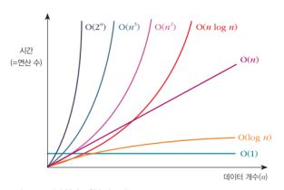

# 자료 구조와 알고리즘

### 정의

**1. 자료 구조**: 자료를 효율적으로 관리하는 방법인데, 쉽게 말해 요리의 재료들이라고 보면 된다. 어떠한 재료들이 있고, 그 재료들을 기준에 맞게 구분해서 정리하는 것이 자료 구조가 있다고 표현한다. 그리고 자료 구조에서 코딩은 재료를 다듬는 과정이라 생각하면 된다.
**2. 알고리즘**: 어떠한 문제를 해결하는 논리적인 과정이다. 쉽게 말해 요리하는 방법이라고 이해하면 된다. 좋은 재료(자료 구조)를 골라서 요리를 하는 과정.

---

### 관계

 재료는 있지만 요리하는 방법을 모르거나, 요리하는 방법은 알지만 어떠한 재료가 신선한지, 혹은 요리에 알맞은 재료인지를 모르면 제대로 된 음식을 먹을 수 없을 것이다. 이처럼 자료 구조와 알고리즘은 항상 연결된 개념이라고 생각하자. 

 자동차 회사를 예로 들면, 자동차 부품들이 '자료 구조에 해당된다. 그리고 이를 활용해 조립 방법을 설계하는 것이 '알고리즘'이고, 그 설계안을 통해 조립하는 것이 '프로그래밍 언어'이다. 마지막으로 완성된 자동차가 바로 '소프트웨어'이다.

---

### 자료 구조의 종류

- 단순 자료구조: 정수, 실수, 문자, 문자열

- 선형 자료구조: 리스트(파이썬 리스트랑 다른 개념), 스택, 큐

- 비선형 자료구조: 트리, 그래프

- 파일 자료구조: 순차 파일, 색인 파일, 직접 파일

---

### 자료 구조 형태

**1. 선형 자료 구조**: 데이터를 한 줄로 순차적으로 표현한 형태로, 줄을 어떻게 연결하냐에 따라 종류가 나뉜다. 비선형보다 이해하기 쉽고 활용하기가 좋다.

**2. 비선형 자료 구조**: 여러 줄로 되어 있는 형태로, 하나의 데이터 뒤에 여러 개가 이어진다. 대표적인 구조로는 트리 구조가 있다. 

---

### 알고리즘 표현법

**1. 일반 언어 표현**

   - 일반적인 자연어를 사용해 설명하듯 알고리즘을 표현
   - 일반 사람이 이해하기 쉽게 표현하나, 최종적으로 코드로 변경하는 데 한계
   - 아이디어가 떠오르지 않을 때, 생각 범위를 넓히는 단계 정도에서 무난

   

**2. 순서도를 이용한 표현**

   - 여러 종류의 상자와 상자를 이어주는 화살표를 이용해 명령 순서를 표현
   - 간단한 알고리즘은 쉽게 표현 가능하지만 복잡한 알고리즘은 표현하기 어려움

   

**3. 의사 코드를 이용한 표현**

   - 프로그래밍 언어보다는 좀 더 인간의 언어에 가까운 형태
   - 프로그램 코드와 일반 언어의 중간 형태
   - 프로그램 코드로 코딩하는 것보다 알고리즘을 좀 더 명확하게 정립하는 데 도움이 된다. 그리고 코드에 설명을 굳이 달지 않아도 이해할 수 있다.
   - 프로그램 코드는 실제 사용하는 프로그래밍 언어를 의미

 실제로는 혼합한 형태로 많이 사용한다. 간단한 알고리즘은 직접 코드로 작성하겠지만, 복잡한 알고리즘은 위 세 가지 방법을 종합적으로 활용해서 표현한다.

---

### 알고리즘의 성능

 알고리즘은 소요 시간을 기준으로 성능 분석을 하는데, 이것을 '시간 복잡도'라고 한다. 하지만 컴퓨터마다 사양이 다르기 때문에 실제로는 '연산 수'가 기준이 된다.  

 알고리즘 성능 표기인데 눈으로 익혀두자. O(1)부터 O(n log n)은 정말 잘했다고 생각하면 된다. 특히 O(1)은 천상계에 속한다. 그리고 활용성에 따라 O(n 제곱)과 O(n log n) 중 더 효율적인 것에 목표를 두고 알고리즘을 계획한다. 예를 들어 O(n제곱) 설계는 하루면 되는데,  O(n log n) 은 한 달이 걸린다. 여기서 만약 프로젝트가 일회성이라면 더 빠른 O(n 제곱)을 선택하는 것이 더 바람직하다.

---

 빅데이터에서 자료구조와 알고리즘을 함께 공부한다면 추후 빅데이터 엔지니어가 되었을 때 많은 도움이 될 것이다. 몰라도 빅데이터를 공부하는 데 무리는 없다. 하지만  향후 실무 투입했을 때 자료구조와 알고리즘을 공부할 상황이 생길 것이다. 지금 정리를 잘 해두면 나중에 고급 알고리즘까지 공부할 수 있을 것이다.