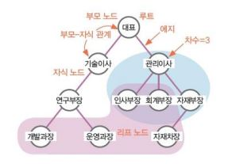

# 트리 구조


- 나무를 거꾸로 뒤집어 놓은 형태 >> 뿌리는 하나다.(root)
- 맨 위 대장(root)이 하나고, 그 아래로 계속 이어져 있다.


---


### 트리 구조 용어



​	각각은 부모 노드이며, 또 자식 노드이다. 오로지 root만이 부모 노드이다. 그리고 이를 부모-자식 관계라 부른다. 그리고 연결하는 선을 에지라 하고, 만약 자신과 연결된 자식 노드가 3개면 이를 차수가 3이라 표현한다. 마지막으로 가장 최하위 소속 집단을 리프 노드라고 한다.


---


### 이진 트리

- 모든 노드의 자식이 최대 2개인 트리(자식이 2개 이하로 구성)

- 이진 트리는 무조건 왼쪽(서브 트리), 오른쪽(서브 트리)으로 나뉜다.
- 번호는 왼쪽에서부터 부여된다.
- 이진 트리는 link가 두 개다. (왼쪽, 오른쪽)


---


### 이진 트리 생성

```python
>>> class TreeNode():
>>>     def __init__(self):
>>>         self.data = None
>>>         self.left = None
>>>         self.right = None
...       
>>> node1 = TreeNode(); node1.data = '사나'
>>> node2 = TreeNode(); node2.data = '지효'; node1.left = node2
>>> node3 = TreeNode(); node3.data = '나연'; node1.right = node3
>>> node4 = TreeNode(); node4.data = '쯔위'; node2.left = node4
>>> node5 = TreeNode(); node5.data = '모모'; node2.right = node5
>>> node6 = TreeNode(); node6.data = '다현'; node3.left = node6
...
>>> print(node1.data)
>>> print(node1.left.data, node1.right.data)
>>> print(node1.left.left.data, node1.left.right.data, node1.right.left.data)
사나
지효 나연
쯔위 모모 다현
```

​	내가 생각한 구조에 맞게 하나씩 left와 right를 사용해서 입력하는 방법이다. 오론쪽, 왼쪽 구분 잘해서 연결해 주자. ;을 사용하면 행을 아낄 수 있다.


---


### 이진 탐색 트리

- 이진 트리 중 활용도가 높은 트리로, 데이터 크기를 기준으로 일정 형태로 구성함
- 왼쪽은 부모 노드보다 작은 값, 오른쪽은 큰 값
- root 변수는 트리 전체 중 가장 위에 있는 변수 >> 다 연결되어 있음


---


### 이진 탐색 트리 생성

```python
memory=[] # 이건 안해도 문제없는데 깔끔하기 위해 사용
root = None
nameAry = ['사나','지효','나연','쯔위','모모','다현']

class TreeNode():
    def __init__(self):
        self.data = None
        self.left = None
        self.right = None
        
node = TreeNode()
node.data = nameAry[0]
root = node
memory.append(node)

for name in nameAry[1:]:
    node = TreeNode()
    node.data = name

    current = root
    while True:  # 몇번을 비교해야 값이 자리를 찾을지 알 수 없기 때문에 무한루프 활용
        if (current.data > name):  # name이 더 작으면 왼쪽, 크면 오른쪽
            if (current.left == None):  # 왼쪽에 자리가 비어있으면
                current.left = node     # 왼쪽에 추가
                break                   # 자리 잡으면 무한반복 끝
            current = current.left      # 아니면 다시 왼쪽으로 가줘
        else:
            if (current.right == None):
                current.right = node
                break
            current = current.right
    memory.append(node)

print('이진 탐색 트리 구성 완료!!')
```

​	우선 root를 설정해 줘야 한다. root가 가장 상위 node이기 때문에 첫 번째로 잡아 주고, 거기서부터 뿌리를 내린다. 사나가 그럼 root가 된다. 그리고 새로운 node를 생성한 뒤, for문을 돌려 nameAry에 있는 인자 하나하나 입력할 수 있도록 하자. 새로운 node에 name을 입력하고, 작업을 수행하기 위해 current를 root로 지정하자.

​	이 다음부터 무한 루프를 활용하는데, 그 이유는 데이터가 많으면 몇 번을 비교해야 하는지 계산하기가 힘들기 때문이다. 만약 name이 현재 작업 중인 data보다 작을 때, 왼쪽으로 가는데, 왼쪽이 비었으면 거기에 자리를 잡고, 이미 있으면 또 아래로 내려가라는 의미다. 반대로 값이 크다면 오른쪽으로 가서 같은 작업을 수행하라는 반복문이다. 그리고 자리를 잡으면 break 해서 벗어나라. 


---


### 이진 탐색 트리 검색

```python
findName = '쯔위'

current = root
while True:
    if current.data == findName:
        print(findName, '찾았다~~ 야호!!')
        break
    elif current.data > findName:
        if current.left == None:
            print(findName, '이 트리에 없어요..')
            break
        current = current.left
    else:
        if current.right == None:
            print(findName, '이 트리에 없어요..')
            break
        current = current.right
        
쯔위 찾았다~~ 야호!!
```

​	쯔위를 찾고 싶다. current를 root로 설정하고, while문을 돌린다. 만약 처음부터 data 값이 쯔위라면 찾았다고 print 하고 while문을 벗어나라. 쯔위가 current data보다 작으면 왼쪽으로 가는데, 공간이 비었으면 없다고 print해라. 그 공간도 꽉 차 있다면 왼쪽으로 더 가서 반복해라. 쯔위가 값이 더 크다면 오른쪽으로 가고, 공간이 비었으면 없다고 print 해주고, 꽉 찼다면 오른쪽으로 가서 반복해라.