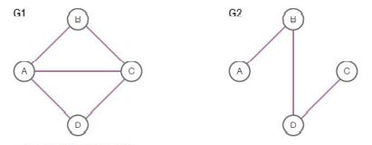
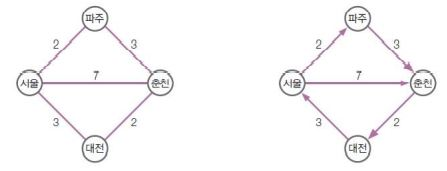
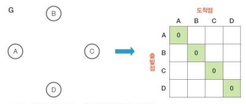

# 그래프


### 정의 및 특징

- 여러 node가 서로 연결된 구조
- 연결은 됐지만 마구잡이로 연결되어 있다.
- root 개념이 없고 모두 동등한 개념
- ex) 지하철 노선도와 링크드인(Linked in)(사회관계망 서비스 연결)


---


### 무방향 구조(일반적)

- Node가 아니라 정점이라고 표현한다. ex) V(G1) = { A, B, C, D }

- 그래프마다 이름이 있다. ex) G1 그래프, G2 그래프

- 에지는 간선을 의미한다. ex) A-B, B-C, C-D (B-A는 중복되기 때문에 안 씀)

  

  


---


### 가중치 그래프

- 간선마다 가중치가 다르게 부여된 그래프

- 무방향 그래프와 방향 그래프에 각각 가중치를 부여한 경우
- 가중치가 있다면 가중치를 고려해서 활용해야 한다.
- 서울에서 춘천으로 바로 가는 것보다 파주를 통해 가는 것이 더 이득이다.




---


### 깊이 우선 탐색

- 그래프의 모든 정점을 한 번씩 방문하는 것을 그래프 순회(Graph Traversal)라고 한다.

- 그래프 순회 방식은 깊이 우선 탐색, 너비 우선 탐색이 대표적
- 방문하지 않은 곳부터 가고, 만약 모두 방문했다면 처음으로 다시 돌아간다.


---


### 그래프 인접 행렬 표현

- 그래프를 코드로 구현할 때는 인접 행렬을 사용한다.
- 인접 행렬은 정방형으로 구성된 행렬로 정점이 4개인 그래프는 4×4로 표현
- 대각선으로 대칭을 이룬다.





---


### 인접 행렬 코드

```python
>>> G = None
...
>>> class Graph():
>>>     def __init__(self, size):
>>>         self.SIZE = size
>>>         self.graph = [ [0 for _ in range(size)] for _ in range(size)]
...       
>>> G = Graph(4)
...
>>> G.graph[0][1] = 1; G.graph[0][2] = 1; G.graph[0][3] = 1
>>> G.graph[1][0] = 1; G.graph[1][2] = 1; G.graph[2][0] = 1
>>> G.graph[2][1] = 1; G.graph[2][3] = 1
>>> G.graph[3][0] = 1; G.graph[3][2] = 1
...
>>> print('무방향 그래프')
>>> for row in range(4):
>>>     for col in range(4):
>>>         print(G.graph[row][col], end = '')
>>>     print()
...
0111
1010
1101
1010
```

 G 그래프를 None 값으로 해주고 class로 Graph 함수를 만들어준다. 행과 열이 같은 2차원 배열을 생성해야 하는 class로 작성한다.  G 그래프를 4로 설정하면 양 변이 4씩 만들어질 것이고, A, B, C, D 정점이 생길 것이다. 그리고 표를 생각하며 표의 위치에 맞게 1을 입력해 준다. 1은 연결된다는 의미고, 0은 연결되지 않았다는 의미다. 그리고 print를 해주는데, for문을 통해 전체 행과 열을 프린트해 주자.