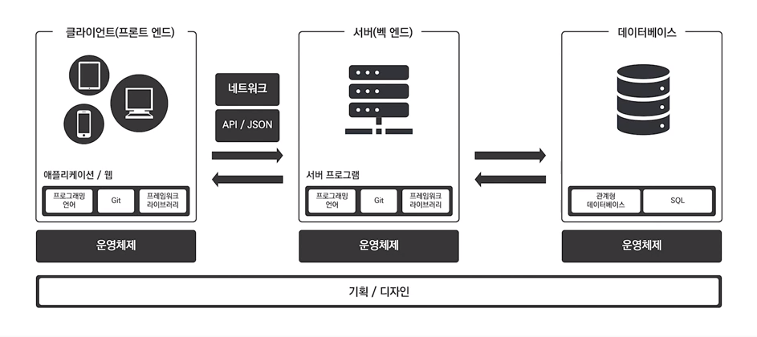

# 비전공자를 위한 IT 지식 - 01

### 목표

- 비전공자는 왜 개발 지식을 강요받는가?
- 첫째, 말이 통하는 사람이 되자. 팀 협업 시 원활한 커뮤니케이션을 위해.
- 둘째, 개발 공부의 방향을 잡기 위해 이 강의를 수강하게 되었다.

---

### 어떻게 배워야 할까?

- IT 세상은 변화가 너무 빠르고 새로운 기술들이 계속해서 나오기 때문에 IT 하나하나 용어를 정의하며 공부하는 것은 바람직하지 않다.
- IT 지도를 그리자. 한 부분을 보며 공부하지 말고 큰 지도를 그려가며 공부할 것!
- 운영체제부터 공부하며 흐름을 파악할 것!

---

### 프로그래밍 언어 - 파이썬

- 개발자라는 사람들은 무엇을 하는 사람들인가?
- 프로그래밍 언어를 배운다는 말이 무슨 의미인가?