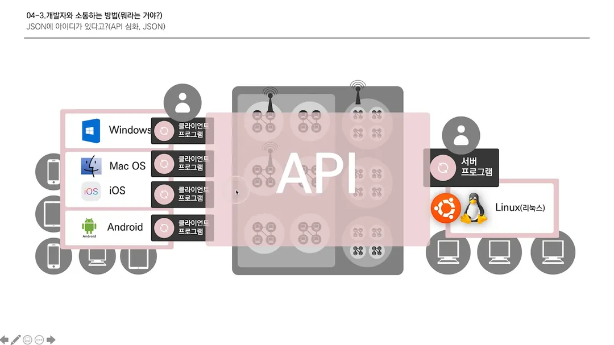

# 비전공자를 위한 IT 지식 - 05

### 커뮤니케이션

​	프로그래머가 힘들어하는 일은?

1. 이름 짓기 - 49%
2. 개발 가능 혹은 불가능한 사항 설명하기 - 16%
3. 개발 작업이 끝나는 시간 산정하기 - 10%
4. 다른 사람과 함께 일하기 - 8%
5. 다른 개발자 코드 작업하기 - 8%
6. 내가 이해할 수 없는 기능 구현하기 - 3%
7. 문서 작성 - 2%

---

### API

​	API는 클라 개발자(프론트 엔드)와 서버 개발자(백 엔드) 사이 중간에 있는 커뮤니케이션 개념이다. 

​	클라이언트가 자료를 요청하면 서버에서 응답을 해준다는 것은 이미 알고 있는 사실이다. 그러면 컴퓨터는 사용자가 어떤 것을 요청하는지 어떻게 구분해서 그에 맞는 응답을 해주는 것일까? 서버 프로그램은 운영체제 위에서 돌며, 각 응답마다 고유 주소가 부여된다. 그리고 요청을 각 응답에 맞게 설정을 하여 응답할 수 있는 체계를 만들었는데 이 체계가 바로 API이다.

​	**먼저 클라이언트의 시점에서 API를 살펴보겠다.** API의 기능은 크게 4가지가 있다. <u>기획자 혹은 개발자라면 이 CRUD 관점에서 생각하는 습관을 기를 필요가 있다.</u>

- **C**reate - 올려줘!
- **R**ead - 불러와줘!
- **U**pdate - 바꿔줘!
- **D**elete - 지워줘!

​	그래서 이 기능들은 서로 다른 주소가 부여되는데, '컴퓨터 주소/contentcreate'와 같이 주소 뒤에 '/path'가 붙는다. 그리고 이 주소는 사용자가 마음대로 정할 수 있다.

​	데이터를 요청할 때는 어떠한 특정 데이터가 필요할 때가 있는데, 이 데이터를 담는 상자를 **'Request'**라고 부른다. 예를 들어 "그 API 요청 보낼 때 **Request**에 ID와 Password 담아서 보내주세요."이런 식으로 말을 한다.

​	각 기능에 대한 주소가 마음대로 수정이 가능하다 보니 너무 다양해져 구분이 어려운 문제가 발생했다. 그래서 개발자들은 이를 해결하기 위해 path를 큰 분류로 정하고 각 기능에 따라 의미에 맞는 스티커를 붙여줬다. 그래서 개발자는 그 스티커를 통해 어떤 요청인지를 구분할 수 있는 것이다. 그리고 우리는 이제 이 스티커를 **'매서드(method)'**라고 부를 것이다. 매서드는 아래와 같다.

- **C**reate - POST

- **R**ead - GET
- **U**pdate - PUT(전체) / PATCH(일부)
- **D**elete - DELETE

​	다음은 **서버 시점에서 API를 살펴보겠다.** 우선 서버는 요청을 받으면 개발자가 코딩한 대로 서버는 돌아간다. 그리고 응답을 해주는데, 이 응답에는 "잘 됐어"와 "잘 안됐어" 이 2가지 밖에 없다. 잘 됐어라는 응답을 우리는 'success', 'good', 'great' 등 다양하게 설정할 수 있는데, 이것 역시 체계적이지 않다는 문제가 발생한다. 그래서 개발자들은 "잘 됐어"를 2xx, "잘 안됐어"를 4xx~5xx 번 대 코드로 지정했다.

​	클라이언트가 요청을 하면 서버는 그에 대한 응답을 하는데, 응답할 데이터를 담는 상자를 **'Response'**라고 부른다.

​	UI(User Interface)는 사용자들이 기능을 사용하기 위해 필요한 버튼이라고 생각하면 된다. 로그인 버튼, 명암 슬라이더, 검색 텍스트 필드, 체크 박스 등이 바로 UI이다. 그래서 개발자들이 UI를 개발하고 사용자들이 버튼을 통해 그 기능들을 사용하는 것이다. 이것이 UI의 기본적인 체계이다. 그래서 UI는 정보를 교환하는 **'공유 경계'**라고 말한다.

​	API도 결국 Interface이다. 그런데 UI는 user와 software와의 인터페이스였다면 API는 software와 software 사이에 있는 인터페이스이다. 즉, 서로 다른 소프트웨어인 클라이언트와 서버끼리 정보를 교환하기 위해 중간에 있는 체계가 바로 API이다. 그래서 API 주소와 기능은 서버 개발자가 만들고 클라이언트는 그것을 사용하는 것이다.

​	

---

### JSON

​	앞서 API에서 Request와 Response는 데이터를 담는 상자(비닐)이라고 말했는데, JSON은 그 안에 담긴 내용물의 형식을 말한다. 내용물의 형식은 매우 다양한데, 이 또한 체계를 갖추기 위해 하나의 형식을 정하려 했고, 최근 개발자들이 가장 선호하는 형식이 바로 JSON인 것이다. 즉, 이 말은 미래에는 JSON이 아닌 다른 형식이 될 수도 있다는 것이다.

​	JSON은 중괄호({})를 통해 시작과 끝을 맺고, 키(key)와 값(value)으로 나뉜다.

- {"id":"amazing", "pw":"qwer1234"}

- {

  "id":"amazing", 

  "pw":"qwer1234",

  "item":["coffee", "latte", "americano"]  - 복수 값 넣기

  }

​	지금까지 배운 내용을 정리해 보자면 클라이언트는 우리가 쓰는 컴퓨터이다. 컴퓨터 바로 위에서는 프로그램을 그냥 돌릴 수 없기 때문에 **'운영체제'**(윈도우, 맥, ios, 안드로이드)가 있고, 그 위에서 클라이언트 프로그램을 돌리는 것이다. 서버도 마찬가지로 컴퓨터이며 운영체제(리눅스) 위에서 서버 프로그램이 돌아간다. 그리고 이 둘 사이 중간에는 **네트워크**가 존재하며 이것이 컴퓨터를 연결한다. 그리고 클라이언트 프로그램을 만드는 사람이 '클라이언트 개발자'이고, 서버 프로그램을 만드는 사람이 '서버 개발자'인데 이 둘은 서로 다른 소프트웨어를 만들기 때문에 이 중간에는 **요청을 보내고 응답을 받는 체계**가 필요하다. 그 체계가 바로 **API**이고, 데이터의 형식이 **JSON**이다. 

