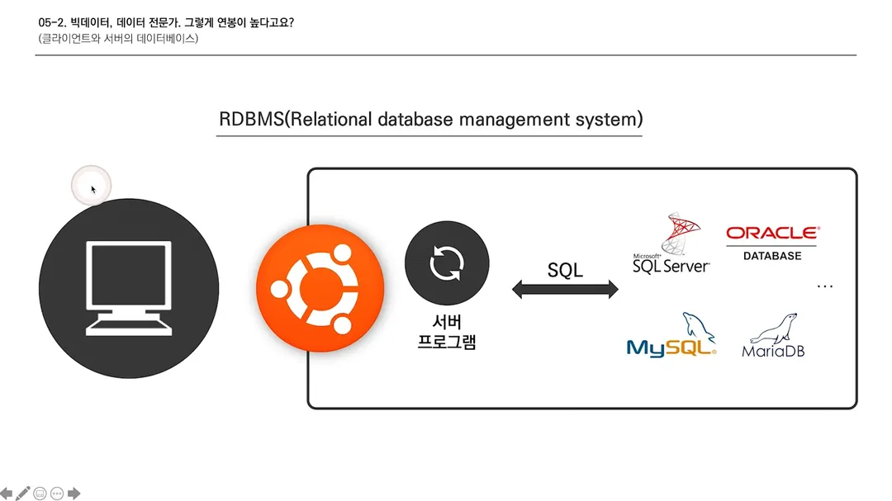

# 비전공자를 위한 IT 지식 - 06

### 데이터베이스

​	데이터를 관리하기란 매우 까다로운 일이다. 데이터의 단 1%도 에러가 나면 안 되기 때문이다. 만약 에러가 난다면 큰 문제로 이어질 수 있다. 그래서 이것을 **'데이터의 무결성'**이라고 부른다. 이 데이터의 무결성을 유지해야 하기 때문에 데이터베이스는 관리하기가 매우 까다롭다. 또한 데이터를 업데이트할 때도 빠른 속도를 요구한다.

​	그래서 사람들은 데이터를 효율적으로 관리할 수 있는 방법을 모색하는데, 근 20~30년을 지배한 방법이 바로 **'관계형 데이터 베이스(RDB : Relational database)'**이다. 관계형 데이터 베이스는 쉽게 생각해서 엑셀이라고 보면 된다. 엑셀은 개발자가 아닌 일반인을 위해 만들어진 관계형 데이터 베이스 기반 프로그램이기 때문이다. 그래서 엑셀에 익숙하면 관계형 데이터 베이스를 쉽게 이해할 수 있다.

​	관계형 데이터 베이스 개념에서 만들어진 프로그램을 **'RDBMS : Relational database management system'**이라고 부르는데, 여기에는 'SQL Server', 'ORACLE', 'MySQL', 'MariaDB'가 있다.

​	실질적으로 돌아가는 방식은 컴퓨터 위에 OS가 돌아가고 그 위에서 RDBMS가 돌아간다. 서버 컴퓨터를 예로 들면 데이터의 요청을 받으면 해당하는 데이터를 데이터 베이스에다가 **'CRUD'** 해준다. 이때 사용하는 언어가 바로 SQL이다. SQL은 프로그래밍 언어가 아닌 명령 언어(조작어)이다. SQL을 통해 데이터 베이스에 데이터를 줘! 바꿔줘! 등을 말할 수 있는 것이다. 

​	앞서 말했듯 데이터는 1%도 변형되면 큰 문제를 발생시키기 때문에 데이터 개발자와 협업을 할 때는 최대한 요청을 뭉텅이로 모아서 하는 것이 좋다. 하나씩 요청하면 그들이 매우 힘들어한다. 

---

### 클라이언트와 서버의 데이터 베이스

​	클라이언트와 서버 모두 각각의 컴퓨터로 돌아간다. 그리고 데이터 베이스는 소프트웨어로 모든 컴퓨터 위에서 돌아갈 것이다. 이 말은 즉 데이터 베이스는 클라이언트와 서버 컴퓨터 모두에 작동할 수 있다는 의미다. 그래서 이 둘을 비교해서 살펴보자.

​	알람과 페이스북을 비교해 보면 알람에 있는 데이터는 클라이언트 사이드이고, 페이스북에 있는 데이터는 서버 사이드 데이터이다. 이 둘의 가장 큰 차이는 바로 네트워크이다. 알람은 네트워크 없이 작동하는 반면 페이스북은 절대 그럴 수 없다. 그리고 페이스북은 핸드폰 혹은 다른 컴퓨터에서도 로그인만 하면 데이터를 확인할 수 있다. 그렇기 때문에 서버 사이드에 데이터가 있다는 말이다. 

​	이 둘을 구분하는 이유는 해당 데이터의 문제 해결을 위함이다. 서버 데이터의 문제는 서버 측에서 문제를 알아보고, 클라이언트 측 문제는 클라이언트에서 해결해야 하기 때문이다. 그래서 각 사이드마다 많이 쓰이는 용어가 있는데, 이것은 알아두자.

​	클라이언트

- 로컬
- 내부DB
- 클라/클라이언트
- 프론트/프론트엔드

​	서버

- 서버
- API요청
- (그냥)DB
- 백/백엔드

​	에버노트는 데이터를 서버에도 넣고, 클라이언트에도 넣는 애플리케이션이다. 그래서 에버노트는 오프라인에서도 가능하며 동기화도 가능한데, 동기화라는 것은 클라이언트에 있는 데이터와 서버에 있는 데이터를 똑같이 만들어 주는 작업을 말한다.

---

### 데이터사이언스 & 인공지능

​	데이터를 다룬다는 것은 데이터를 **수집하는 것, 저장/분석하는 것, 시각화**하는 것으로 나뉜다. 먼저 수집한다는 것은 어디서 수집하냐가 중요하다. **web**(뉴스, 증시, SNS, 포탈, 공공 데이터 등)이나 **service**(기업)로 나뉘는데, web에서 데이터를 가져오는 것을 **크롤링/스크레이핑**이라고 부른다. 서비스는 고객이 기업의 서비스를 이용하며 남기는 데이터들을 추적하는 것이다. 대표적으로 **Google Analytics**가 있다.

​	저장과 분석은 크게 전처리, 설계, 저장으로 나뉜다. 데이터를 보면 오타도 있을 것이고, 빈 공간도 있을 것이다. 이것들을 작업하여 유의미하게 만드는 것을 전처리이라 부른다. 그리고 이 데이터를 설계하고 저장하는 과정을 거친다. 그러고 나서 이 저장한 데이터를 분석해야 한다. 이때 필요한 것이 통계 / 확률 / 기계학습이 있다.

​	마지막으로 분석한 데이터를 사람들이 이용할 수 있도록 시각화하는 작업이 필요하다. 그래프나 숫자 등 효과적인 방법으로 나타내기 위해 많은 연구가 필요하다. 

