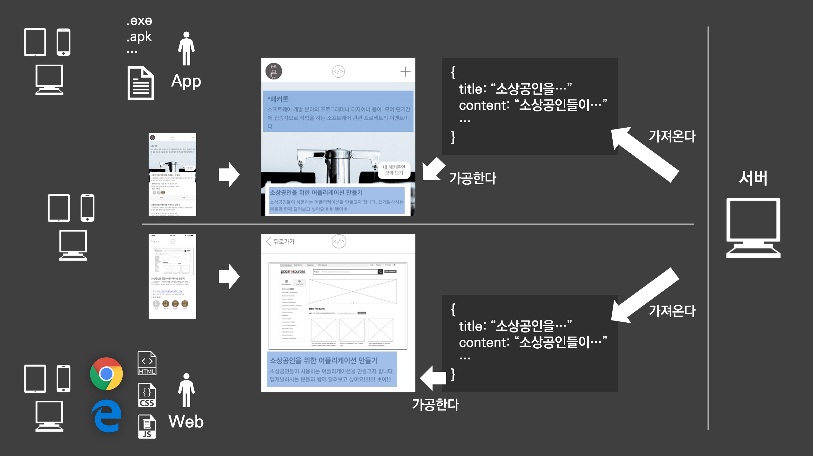
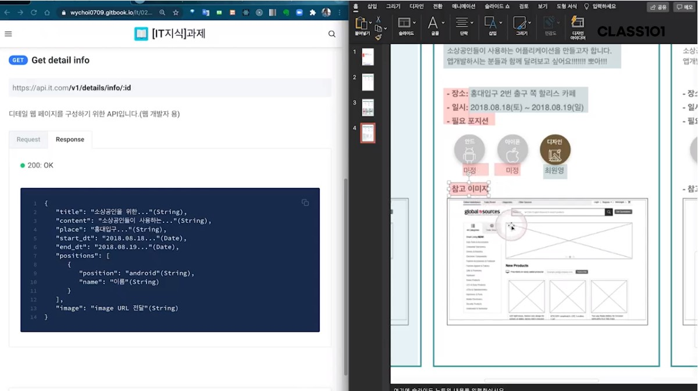
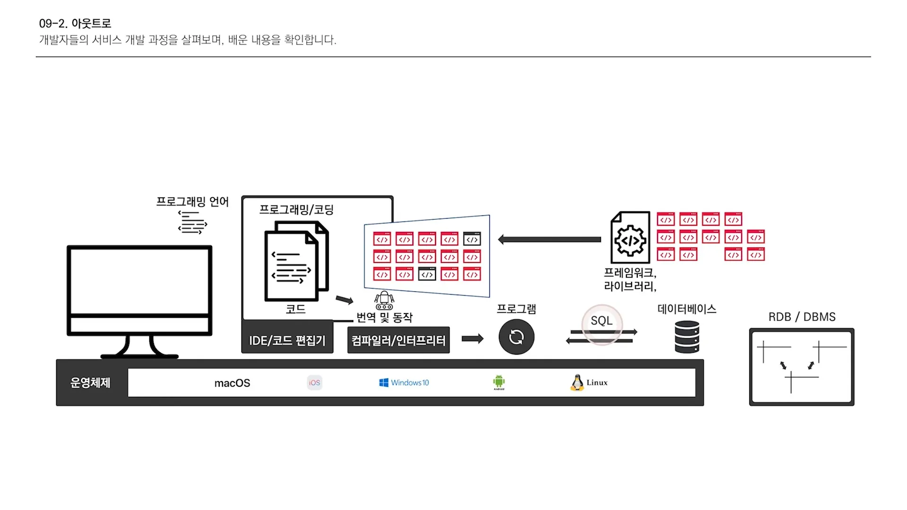

# 비전공자를 위한 IT 지식 - 08

### 스케치 & 피그마

​	과거 디자이너들이 많이 쓰는 툴은 **'일러스트'**와 **'포토샵'**이 대표적이다. 디자이너들이 우선적으로 디자인을 구상하고 개발자에게 그 내용을 전달하면 개발자는 디자이너의 요구에 알맞게 개발한다. 하지만 개발자가 만든 결과물과 디자이너의 구상안 사이에는 괴리가 존재할 수 있다. 그 이유는 매우 다양한데, 이유들에 대해서는 다음 시간에 알아보겠다.

​	이러한 이슈를 해결하기 위해 개발자는 디자이너에게 **'가이드'**를 요청한다. 하지만 디자이너들이 디자인도 하면서 가이드를 만들기란 매우 힘든 일이다. 그래서 전통적으로 이 두 직군은 싸우기도 하며 사이가 좋진 않았다.

​	결국 사람들은 이 두 집단을 떨어뜨리고 그 사이에서 완충작용을 할 수 있는 툴(Tool)을 생각해낸다. 가장 대표적인 것이 바로 **'스케치'**와 **'피그마'**이다. 이러한 툴들은 가로가 얼마고, 세로는 얼마나 되고, 혹은 x나 y의 값도 알려준다. 이러한 툴들이 나오면서 디자이너와 개발자의 사이가 개선되기 시작했다.

---

### API 문서 & 서비스 분석

​	협업을 하기 위해서는 어떤 작업이 어떤 개발자가 하는 것인지, 어떤 부분이 클라이언트 사이드인지, 서버 사이드이지 정도는 구분할 줄 알아야 한다. 가장 먼저 앱인지 웹인지 혹은 하이브리드인지부터 구분을 하고, 클라이언트와 서버를 구분한다. 그리고 서버 쪽 문제라면 API에서 가져올 때 문제가 되었는지 혹은 가공할 때 문제가 되었는지도 알아보아야 한다.

​	예를 들어 API JSON을 확인했을 때 이미지가 포함되어 있다고 가정한다. 이때 이미지에 관한 문제를 누구에게 말하면 될까? API에서 받아오는 것이기에 서버 개발자를 찾아가 우선적으로 여쭤보는 것이다.

​	위 사진처럼 API 문서를 확인하면 서버 사이드에서 가져오는 정보인지 혹은 클라이언트 사이드에서 작업을 하는 것인지 알 수 있다.

---

### 마지막 정리

​	개발자들은 운영체제 위에서 프로그램을 개발을 하며 IDE 혹은 코드 편집기를 활용하여 코딩 작업을 한다. 이때 사용하는 언어가 바로 프로그래밍 언어인데, 이것이 바로 컴퓨터로 전달되는 것이 아니라 컴파일러나 인터프리터를 통해 번역 작업을 거친다. 그렇게 프로그램이 만들어지면 데이터들은 데이터베이스에 저장이 되고, 사용자가 데이터베이스를 활용하기 위해 사용하는 명령언어가 바로 SQL이다.