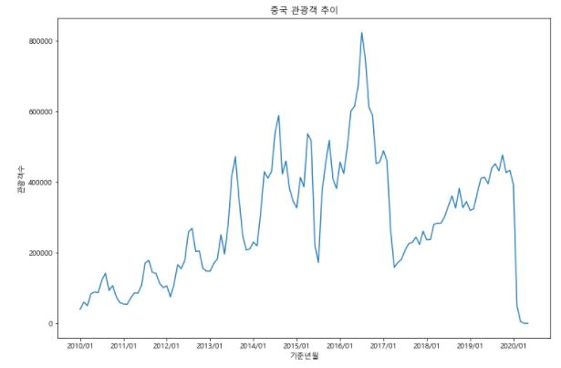
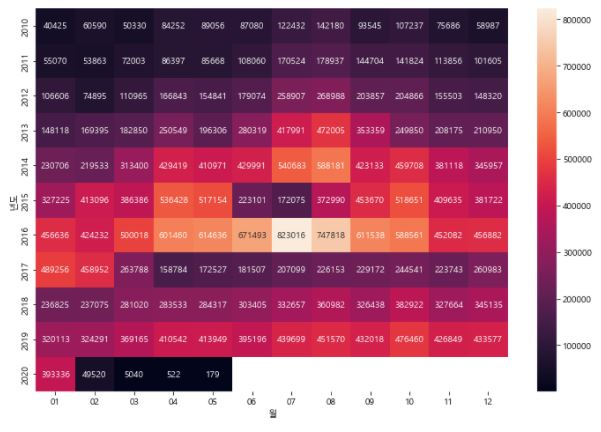
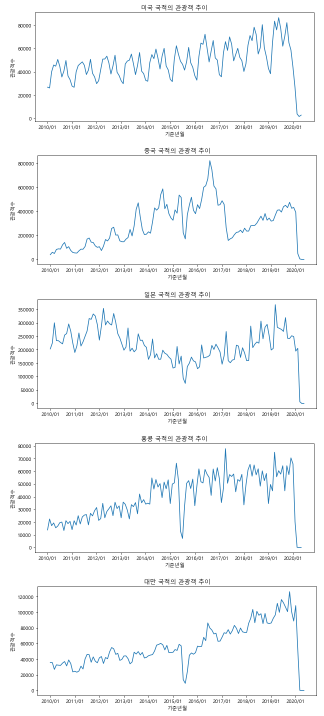

# 방한 외래관광객 시각화 분석


### 학습 목표

- 저번 시간에 다룬 관광객 파일을 matplotlib과 seaborn 라이브러리를 통해 시각화할 수 있다.
- 중국 관광객의 유입을 시계열 그래프와 heatmap으로 시각화하고 Insight를 얻을 수 있다.
- 중국, 일본, 미국, 대만, 홍콩의 관광객 유입을 비교할 수 있다.


---


### 라이브러리

```python
import pandas as pd
import numpy as np
import matplotlib.pyplot as plt
from matplotlib import rc, font_manager
import seaborn as sns
```

​	오늘 사용할 라이브러리를 불러온다. 시각화를 위해 matplotlib과 seaborn 라이브러리를 불러온다.


---


### 중국 관광객 data만 확인하기

```python
df = pd.read_excel('./files/kto_total.xlsx')
condition = df['국적'] == '중국'
df_china = df[condition]
```

​	pandas read() 함수를 통해 kto_total 엑셀 파일을 df 변수에 담아서 data를 확인한다. 그리고 중국의 관광객 data만 보기 위해 마스크 기능을 사용한다.


---


### 시계열 그래프

```python
plt.figure(figsize=(12,8))
plt.plot(df_china['기준년월'],df_china['관광'])
plt.title('중국 관광객 추이')
plt.xlabel('기준년월')
plt.ylabel('관광객수')
plt.xticks(['2010/01','2011/01','2012/01','2013/01','2014/01','2015/01','2016/01','2017/01','2018/01','2019/01','2020/01'])
plt.show()
```

​	순서대로 설명하자면 먼저 figure은 그래프의 크기를 설정하는 코드다. (x, y)의 크기가 들어간다. 그리고 plot은 시계열 그래프를 그리는 함수로 x를 '기준년월', y를 '관광'으로 설정했다. 이렇게 해야 연도에 따른 관광객 수를 비교할 수 있기 때문이다. 그리고 그래프의 타이틀을 '중국 관광객 추이'로 설정하고, x축과 y축 각각의 라벨을 넣었다. 그리고 x의 눈금 설정은 xticks로 설정하면 되는데, 각 연도별 1월로 설정했다. 그리고 show를 통해 그래프를 확인한다.


---


### 중국 관광객 추이 시계열 그래프 해석




- 2010년부터 2016년까지 관광객이 계속해서 증가하는 것을 볼 수 있다.(Trend)
- 2017년 초에 관광객 수가 큰 폭으로 감소했다.(Event)
- 2017년 중순부터 다시 관광객 수가 완만하게 증가한다.(Trend)
- 매년 여름에 관광객 수가 최댓값을 갖는다.(Seasonality)
- 단, 2015년 여름 관광객 수가 큰 폭으로 감소한다.(Event)
- 2020년 초에 관광객 수가 0에 가까워질 만큼 급격히 감소한다.(Event)


---


### pivot table 만들기

```python
df['년도'] = df['기준년월'].str.slice(0,4)
df['월'] = df['기준년월'].str.slice(5,7)
```

​	피벗테이블을 만들기 전 '년도'와 '월' columns을 추가한다. 피벗테이블을 만들 때 각각 인덱스와 컬럼을 설정하기 위함이다.


```python
condition = df['국적'] == '중국'
df_china = df[condition]

china_pivot = df_china.pivot_table(values='관광', index='년도', columns='월')
```

​	국적이 중국인 데이터를 갖고 와서 중국 파일만 피벗테이블로 만들어줄 것이다. index는 '년도'로 지정하고 columns은 '월'로 지정한다. 그리고 values는 '관광'으로 지정하겠다. 이렇게 되면 연도와 월별로 관광객 수를 확인할 수 있다.


---


### Heatmap 만들기

```python
import seaborn as sns
```

​	히트맵을 만들기 위해서는 seaborn 라이브러리가 필요하다.


```python
plt.figure(figsize=(12,8))
sns.heatmap(china_pivot, annot = True, fmt = '.0f')
plt.show()
```

​	heatmap()을 알아보겠다. 우선 가장 처음에 그래프의 데이터를 입력한다. 나는 중국 관광객을 볼 것이기 때문에 china_pivot을 데이터 위치에 넣었다. 그리고 annot은 그래프 각 칸에 실제 값을 표시하는 옵션이다. 값을 알고 싶다면 True로 설정해 주자. 그리고 fmt는 숫자 형태를 정할 수 있는 옵션인데, '.0f'로 입력하면 소수점이 없는 실수형으로 표현된다. 마지막으로 cmap이라고 그래프의 색깔을 지정할 수 있는 옵션이 있는데, 색은 자동으로 지정되기 때문에 나는 안 넣어줬다.


---


### Heatmap 해석



- 위에서(2010) 아래로(2017) 내려오면서 색깔이 점점 밝아지는 것으로 보아 2010년 1월부터 2017년 3월까지 관광객 수가 꾸준히 증가하는 것을 알 수 있다.(Trend)
- 각 연도 기준 7~8월(중앙)이 대체로 연한 색을 띠면서, 여름에 관광객이 가장 많이 방문하는 패턴을 보인다.(Seasonality)
- 2015년 6~8월에 갑자기 관광객 수가 적어졌다.(Event)
- 2017년 3~6월까지 관광객 수가 매우 적다.(Event)
- 2020년 2월 관광객 수가 급격히 줄어들었다.(Event)


---


### 원인 분석

- 2015년 6~8월은 메르스 여파 때문에 관광객이 줄어든 것으로 보임
- 2017년 3월은 중국의 사드 보복 조치로 관광객이 줄어든 것으로 보임
- 2020년 코로나 바이러스로 인해 관광객 급격히 감소


---


### 다국적 관광객 시계열 그래프 그리기

```python
contry = ['미국','중국','일본','홍콩','대만']

for i in contry:
    condition = df['국적'] == i
    df_filter = df[condition]
    
    plt.figure(figsize=(10,4))
    plt.plot(df_filter['기준년월'], df_filter['관광'])
    plt.title('{} 국적의 관광객 추이'.format(i))
    plt.xlabel('기준년월')
    plt.ylabel('관광객수')
    plt.xticks(['2010/01','2011/01','2012/01','2013/01','2014/01','2015/01','2016/01','2017/01','2018/01','2019/01','2020/01'])
plt.show()
```

​	앞서 중국의 관광객을 알아봤다면, 이제는 미국, 중국, 일본, 홍콩, 대만 총 5개의 나라를 시계열 그래프로 시각화해보겠다. 코드는 위에서 했던 것과 동일하다. 다만 for문이 추가되었다. for문을 통해 contry를 i가 하나씩 돌고, 국적 하나씩 시계열 그래프를 만든다.





​	결과는 사진과 같이 나온다. 모두 2020년에 동일하게 감소했다. 코로나 여파로 인한 결과로 해석된다. 미국의 경우 꾸준히 증가하는 모습을 보인다. 일본의 경우엔 2013년부터 지속적으로 감소하다가 2015년부터 다시 증가한다. 대만의 경우 지속적으로 증가하다가 2015년 절반 무렵에 급감소했다. 대만은 다른 국가에 비해 그래프 높낮이의 차이가 비교적 없는 편이다. 그리고 대만 역시 2015년에 급감소했다. 미국을 제외하고 대부분의 국가가 2015년에 급감했다. 


---


### 다국적 관광객 heatmap 그리기

```python
for i in contry:
    condition = df['국적'] == i
    df_filter = df[condition]
    df_pivot = df_filter.pivot_table(index='년도', columns='월', values='관광')
    
    plt.figure(figsize=(10,6))
    sns.heatmap(df_pivot, annot=True, fmt='.0f', cmap='rocket_r')
    plt.title('{} 관광객 히트맵'.format(i))
plt.show()
```

​	Heatmap도 같은 조건으로 그렸다. for문을 사용했고, 시계열 그래프와의 차이점은 heatmap은 피벗테이블을 만들어줬다는 것이다. cmap은 그래프의 색상을 지정하는 옵션이다.
